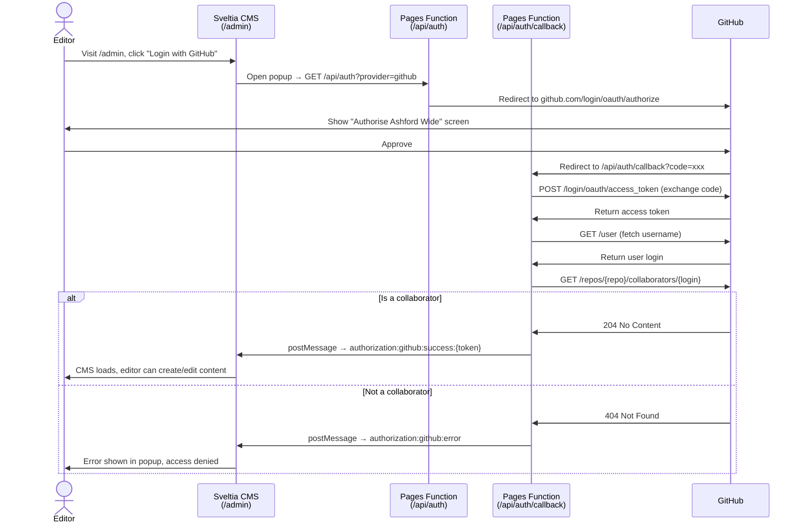

# Sveltia CMS (`static/admin/`)

Full reference: [Sveltia CMS docs](https://sveltiacms.app/en/docs/intro) · [Hugo framework guide](https://sveltiacms.app/en/docs/frameworks/hugo)

Served at `/admin/`. Edits are committed directly to the GitHub repo, triggering a Cloudflare Pages rebuild (~30 seconds).

[Sveltia CMS](https://sveltiacms.app/en/docs/intro) is a drop-in replacement for Decap CMS. It uses the same `config.yml` schema and the same GitHub OAuth flow, but is significantly smaller (~600 KB vs 1.5 MB) and does not require `unsafe-eval` in the CSP.

## Authentication

Sveltia CMS authenticates editors via [GitHub OAuth](https://docs.github.com/en/apps/oauth-apps/building-oauth-apps/creating-an-oauth-app). The OAuth flow is handled by two [Cloudflare Pages Functions](https://developers.cloudflare.com/pages/functions/) (no external service required):

| File | Route | Purpose |
|------|-------|---------|
| `functions/api/auth/index.js` | `GET /api/auth` | Redirects to GitHub OAuth authorisation |
| `functions/api/auth/callback.js` | `GET /api/auth/callback` | Exchanges code for token, checks collaborator access |

### Required environment variables ([Cloudflare Pages dashboard](https://developers.cloudflare.com/pages/configuration/build-configuration/#environment-variables))

| Variable | Value |
|----------|-------|
| `GITHUB_CLIENT_ID` | From the GitHub OAuth App |
| `GITHUB_CLIENT_SECRET` | From the GitHub OAuth App |
| `GITHUB_REPO` | e.g. `magnoliaceiling/ashford_wide` |

### One-time setup steps

1. **Create a GitHub OAuth App** — GitHub → Settings → Developer settings → OAuth Apps → [New OAuth App](https://docs.github.com/en/apps/oauth-apps/building-oauth-apps/creating-an-oauth-app):
   - Homepage URL: `https://www.ashfordwide.com`
   - Authorization callback URL: `https://www.ashfordwide.com/api/auth/callback`
2. **Add the three environment variables** above in the Cloudflare Pages dashboard
3. **Update `static/admin/config.yml`** — set `repo:` to the correct GitHub org/repo

### Managing editor access

Access is controlled by [GitHub repository collaborators](https://docs.github.com/en/rest/collaborators/collaborators). To grant CMS access to an editor:

- GitHub repo → Settings → Collaborators → Add people → enter their GitHub username

The Pages Function checks collaborator status at login time — non-collaborators are blocked before the CMS loads with a clear error message identifying their GitHub username.

To revoke access, remove them as a collaborator on GitHub.

## Local development

Sveltia CMS does not use a proxy server for local development. Instead it uses the browser's [File System Access API](https://developer.mozilla.org/en-US/docs/Web/API/File_System_Access_API) to read and write files directly in your local repo.

1. Run `hugo server` as normal
2. Visit `http://localhost:1313/admin/`
3. When prompted, open your local repo folder via the browser file picker
4. Edits are written directly to your local files
5. Commit and push changes using git as normal

**Browser compatibility:** Chrome or Edge required for File System Access API. Safari support is limited.

## CMS Collections

Full reference: [Sveltia CMS collections](https://sveltiacms.app/en/docs/collections) · [Sveltia CMS fields](https://sveltiacms.app/en/docs/fields)

| Collection | Type | Manages |
|-----------|------|---------|
| `events` | folder | `content/events/{year}/*.md` — path template `{{year}}/{{slug}}` |
| `news` | folder | `content/news/{year}/*.md` — path template `{{year}}/{{slug}}` |
| `pages` | files | about, membership, business-membership, volunteer, support, contact |
| `remembrance` | files | All 4 remembrance pages |
| `members` | files | `data/members.yaml` |
| `businesses` | files | `data/businesses.yaml` |

Events and news use a `path: "{{year}}/{{slug}}"` template to preserve the year-subfolder structure in the repo (keeping Hugo's `permalinks` config working). Editors see a flat list in the CMS rather than a year tree — Sveltia's nested collection support is planned for v2.0 (mid-2026). `content/events/past.md` sits outside the year folder structure and is not managed by the CMS.

`omit_empty_optional_fields: true` is set globally so optional fields are not written to front matter when left blank.

## Markdown Widget — Supported Formatting

| Element | Rich text editor | Raw Markdown mode |
|---|---|---|
| Headings, bold, italic, links, lists | Yes — toolbar buttons | Yes |
| Blockquote | Yes — toolbar button | Yes (`>` syntax) |
| Table | **No** — no visual table builder | Yes (GFM pipe syntax) |
| Code block | Yes — toolbar button | Yes |

Tables must be written in raw Markdown mode using standard GFM syntax.
