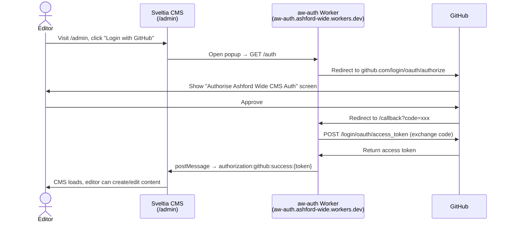

# Sveltia CMS (`static/admin/`)

Full reference: [Sveltia CMS docs](https://sveltiacms.app/en/docs/intro) · [Hugo framework guide](https://sveltiacms.app/en/docs/frameworks/hugo)

Served at `/admin/`. Edits are committed directly to the GitHub repo, triggering a Cloudflare Pages rebuild (~30 seconds).

[Sveltia CMS](https://sveltiacms.app/en/docs/intro) is a drop-in replacement for Decap CMS. It uses the same `config.yml` schema and the same GitHub OAuth flow, but is significantly smaller (~600 KB vs 1.5 MB) and does not require `unsafe-eval` in the CSP.

## Authentication

Sveltia CMS authenticates editors via [GitHub OAuth](https://docs.github.com/en/apps/oauth-apps/building-oauth-apps/creating-an-oauth-app). The OAuth flow is handled by a standalone Cloudflare Worker, [`Ashford-Wide/aw-auth`](https://github.com/Ashford-Wide/aw-auth) (a deployment of [sveltia/sveltia-cms-auth](https://github.com/sveltia/sveltia-cms-auth)) — this is a separate Cloudflare Worker project, not part of this repo's Pages build, deployed independently via its own `wrangler deploy`.



Unlike the earlier design (Pages Functions in this repo), collaborator access is not checked by the Worker itself — the GitHub token it returns is scoped to whatever access the authenticating user already has on the repo. A non-collaborator can complete the OAuth flow but their subsequent GitHub API calls (reading/writing content) will fail with permission errors.

### GitHub OAuth App

Registered under the org, not a personal account: `https://github.com/organizations/Ashford-Wide/settings/applications`.

| Field | Value |
|---|---|
| Homepage URL | `https://www.ashfordwide.com` |
| Authorization callback URL | `https://aw-auth.ashford-wide.workers.dev/callback` |

Only Ashford-Wide org owners can view/edit this OAuth App or rotate its client secret.

### aw-auth Worker configuration

Deployed from [`Ashford-Wide/aw-auth`](https://github.com/Ashford-Wide/aw-auth) via `wrangler deploy`, to `https://aw-auth.ashford-wide.workers.dev`.

| Variable | Type | Value |
|----------|------|-------|
| `GITHUB_CLIENT_ID` | secret (`wrangler secret put`) | From the GitHub OAuth App |
| `GITHUB_CLIENT_SECRET` | secret (`wrangler secret put`) | From the GitHub OAuth App |
| `ALLOWED_DOMAINS` | var | `www.ashfordwide.com` — restricts which sites can use this Worker's OAuth flow |

### `static/admin/config.yml`

```yaml
backend:
  name: github
  repo: Ashford-Wide/ashford_wide
  branch: main
  base_url: https://aw-auth.ashford-wide.workers.dev
```

`auth_endpoint` is left at its default (`/auth`), matching the route the Worker exposes.

### CSP requirements

`static/_headers` must allow the Worker origin in `connect-src` (the login popup calls it via `fetch`/XHR), and must allow Sveltia CMS's own asset loading:

| Directive | Addition | Reason |
|---|---|---|
| `connect-src` | `https://aw-auth.ashford-wide.workers.dev` | OAuth token exchange |
| `connect-src` | `data:` | Sveltia loads its branding logo as a `data:` URI |
| `connect-src` | `https://www.githubstatus.com` | Sveltia's backend-status indicator |
| `style-src` | `https://fonts.googleapis.com` | Sveltia's Google Fonts stylesheet |
| `font-src` | `'self' https://fonts.gstatic.com` | Not set previously, so it fell back to `default-src 'self'` and blocked the font files |

See [`docs/security.md`](security.md) for the full current policy.

### Managing editor access

Access is controlled by [GitHub repository collaborators](https://docs.github.com/en/rest/collaborators/collaborators). To grant CMS access to an editor:

- GitHub repo → Settings → Collaborators → Add people → enter their GitHub username

The Pages Function checks collaborator status at login time — non-collaborators are blocked before the CMS loads with a clear error message identifying their GitHub username.

To revoke access, remove them as a collaborator on GitHub.

## Local development

Sveltia CMS does not use a proxy server for local development. Instead it uses the browser's [File System Access API](https://developer.mozilla.org/en-US/docs/Web/API/File_System_Access_API) to read and write files directly in your local repo.

1. Run `hugo server` as normal
2. Visit `http://localhost:1313/admin/`
3. When prompted, open your local repo folder via the browser file picker
4. Edits are written directly to your local files
5. Commit and push changes using git as normal

**Browser compatibility:** Chrome or Edge required for File System Access API. Safari support is limited.

## CMS Collections

Full reference: [Sveltia CMS collections](https://sveltiacms.app/en/docs/collections) · [Sveltia CMS fields](https://sveltiacms.app/en/docs/fields)

| Collection | Type | Manages |
|-----------|------|---------|
| `events` | folder | `content/events/{year}/*.md` — path template `{{year}}/{{slug}}` |
| `news` | folder | `content/news/{year}/*.md` — path template `{{year}}/{{slug}}` |
| `pages` | folder, `create: true`, `delete: false` | Every top-level `.md` file directly in `content/` (non-recursive, so `events/`, `news/`, `remembrance-day/`, `business-member/` are untouched) — editors can create new top-level pages here |
| `remembrance` | files | All 4 remembrance pages |
| `members` | files | `data/members.yaml` |
| `businesses` | files | `data/businesses.yaml` |

Events and news use a `path: "{{year}}/{{slug}}"` template to preserve the year-subfolder structure in the repo (keeping Hugo's `permalinks` config working). Editors see a flat list in the CMS rather than a year tree — Sveltia's nested collection support is planned for v2.0 (mid-2026). `content/events/past.md` sits outside the year folder structure and is not managed by the CMS.

`omit_empty_optional_fields: true` is set globally so optional fields are not written to front matter when left blank.

## Markdown Widget — Supported Formatting

| Element | Rich text editor | Raw Markdown mode |
|---|---|---|
| Headings, bold, italic, links, lists | Yes — toolbar buttons | Yes |
| Blockquote | Yes — toolbar button | Yes (`>` syntax) |
| Table | **No** — no visual table builder | Yes (GFM pipe syntax) |
| Code block | Yes — toolbar button | Yes |

Tables must be written in raw Markdown mode using standard GFM syntax.
