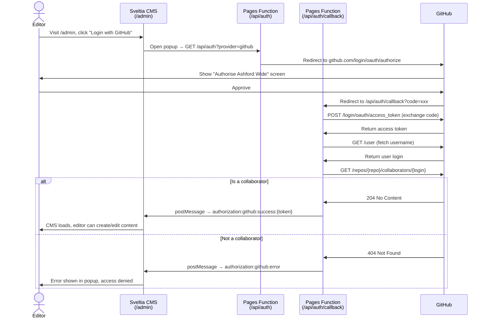

# Ashford Wide — Technical Documentation

## Project Overview

Static website for Ashford Wide, a non-profit community group in [Ashford, Surrey](https://en.wikipedia.org/wiki/Ashford,_Surrey). The site is built with Hugo and deployed to Cloudflare Pages. Content is managed via Decap CMS at `/admin/`.

**Live domain:** `https://www.ashfordwide.com/`  
**Stack:** Hugo v0.159.1 · Tailwind CSS v4 · No JS framework · Decap CMS · Cloudflare Pages

---

## Directory Structure

```
ashford_wide/
├── hugo.toml                    # Site configuration
├── package.json                 # Node dependencies and npm scripts
├── .achecker.yml                # Accessibility checker configuration (WCAG 2.2)
├── scripts/
│   └── a11y-test.js             # Accessibility scan script (uses achecker programmatic API)
├── functions/
│   └── api/auth/
│       ├── index.js             # OAuth start — redirects to GitHub
│       └── callback.js          # OAuth callback — exchanges code, checks collaborator access
├── tailwind.config.js           # Tailwind theme configuration
├── postcss.config.js            # PostCSS configuration for Hugo Pipes
├── assets/
│   ├── css/main.css             # Tailwind base, components, and utilities
│   └── js/
│       ├── nav.js               # Mobile nav toggle (served via Hugo Pipes)
│       └── business-directory.js # Category filter for business directory
├── content/                     # Markdown content files
├── layouts/                     # Hugo templates
│   ├── _default/                # Catch-all templates
│   ├── events/                  # Event-specific templates
│   ├── news/                    # News-specific templates
│   ├── partials/                # Reusable template fragments
│   │   ├── jsonld/              # Schema.org JSON-LD partials
│   ├── index.html               # Homepage template
│   ├── sitemap.xml              # Custom sitemap template
│   ├── robots.txt               # Robots.txt template
│   └── 404.html                 # 404 page
├── static/
│   ├── _headers                 # Cloudflare Pages HTTP headers (CSP, etc.)
│   ├── images/                  # Static images (logo, member logos, etc.)
│   └── admin/
│       ├── index.html           # Decap CMS entry point
│       └── config.yml           # Decap CMS schema
└── data/
    ├── businesses.yaml          # Business directory entries
    ├── members.yaml             # Member logos for homepage marquee
    └── team.yaml                # Team member placeholders
```

---

## Configuration (`hugo.toml`)

```toml
baseURL = "https://ashford-wide.pages.dev"
languageCode = "en-gb"
title = "Ashford Wide"
publishDir = "public"
paginate = 9             # News list pages — 9 per page (fits 3-column grid evenly)
buildDrafts = false
buildFuture = true       # Required — events are often future-dated
enableRobotsTXT = true
disableHugoGeneratorInject = true

[params]
  legalName = "Ashford Wide"                 # Legal registered name — used in org JSON-LD
  description = "Working together for a better Ashford"
  tagline = "Working together for a better Ashford"
  showRemembrance = false                    # Set true to show Remembrance link in nav
  email = "community@ashfordwide.com"        # General contact email
  businessEmail = "business@ashfordwide.com" # Business-specific contact email
  ogImage = "/images/og-default.jpg"         # Default Open Graph image (1200×630px)
  companyNumber = ""                         # Companies House number — omitted from JSON-LD if blank
  facebook = "https://www.facebook.com/AshfordWide"
  twitter = "https://twitter.com/AshfordWide"
  instagram = "https://www.instagram.com/ashfordwide"

[markup.goldmark.renderer]
  unsafe = true   # Allows raw HTML inside Markdown (used in contact form, support page)

[taxonomies]
  tag = "tags"

[permalinks]
  [permalinks.page]
    news = "/news/:contentbasename/"
    events = "/events/:contentbasename/"
```

`buildFuture = true` is essential — without it Hugo will not render pages for future-dated events.

The `permalinks` rules use `:contentbasename` (filename only, no directory) so that news and events can be organised into year subdirectories without the year appearing in the URL. For example, `content/events/2026/summer-market-2026.md` resolves to `/events/summer-market-2026/`.

---

## Content Architecture

### Content Types

```
content/
├── _index.md
├── about.md
├── business-directory.md            # Uses layout: "business-directory"
├── business-membership.md
├── contact.md                       # Contains raw HTML Formspree form
├── membership.md
├── support.md                       # Contains raw HTML PayPal donation embed
├── volunteer.md
├── events/
│   ├── _index.md
│   ├── past.md                      # Renders /events/past/ archive page; excluded from page lists
│   ├── 2022/
│   │   └── jubilee-picnic-park.md
│   ├── 2025/
│   │   ├── christmas-market-2025.md
│   │   ├── classic-car-show-2025.md
│   │   └── remberance-sunday-2025.md
│   └── 2026/
│       ├── ritual-sacrifice.md
│       ├── spring-festival-2026.md
│       └── summer-market-2026.md
├── news/
│   ├── _index.md
│   ├── welcome-to-ashford-wide.md
│   ├── 2014/
│   ├── 2015/
│   ├── 2016/
│   ├── 2017/
│   ├── 2019/
│   ├── 2022/
│   ├── 2025/
│   └── 2026/
└── remembrance/
    ├── _index.md                        # Uses layout: single — suppresses default child-page card grid
    ├── order-of-services.md
    ├── sponsor-a-poppy.md
    └── virtual-poppy-wall.md
```

### Year Subdirectory Organisation

Both `content/news/` and `content/events/` organise files into year subdirectories (`2025/`, `2026/`, etc.) without affecting public URLs. This is achieved via the `permalinks` config (see above). Adding new content to the correct year folder requires no other changes — the URL is always derived from the filename alone.

### `content/events/past.md`

This file exists solely to generate the `/events/past/` archive page using `layouts/events/past.html`. It is excluded from all Hugo page collections via:

```yaml
build:
  list: never
  render: always
```

Do not delete this file — the `/events/past/` URL depends on it.

### Event Front Matter

```yaml
---
title: "Summer Market 2026"
date: 2026-07-11
startTime: "10:00"          # 24hr HH:MM — optional
endTime: "15:00"            # 24hr HH:MM — optional
location: "High Street, Ashford"
address: "High Street"      # Street address — optional, added to schema.org output
description: "Short summary shown on event cards and in meta tags."
image: "/images/events/summer-market-2026.jpg"  # optional
endDate: "2026-07-12"       # optional — only for multi-day events
eventStatus: EventCancelled # optional — overrides default EventScheduled
attendanceMode: OnlineEventAttendanceMode  # optional — overrides default OfflineEventAttendanceMode
---
```

The `date` field drives all event filtering. The events list template splits events into upcoming (`date >= now`) and past (`date < now`) automatically. No manual archiving is needed.

`startTime` and `endTime` are stored as `HH:MM` 24hr strings. The `layouts/partials/event-time.html` partial formats them for display (e.g. `10am–3pm`). They are also combined with `date` to produce ISO-8601 datetime values in the schema.org JSON-LD output (e.g. `2026-07-11T10:00`).

### News Front Matter

```yaml
---
title: "Spring Events Programme Announced"
date: 2026-03-15
author: "Ashford Wide Team"
description: "Short summary shown on news cards."
image: "/images/news/spring-events.jpg"  # optional
---
```

### Standard Page Front Matter

```yaml
---
title: "Page Title"
description: "Used in <meta name='description'> and page header subtitle."
layout: "business-directory"  # optional — overrides the default template
---
```

---

## Template Architecture

### Inheritance

All pages extend `layouts/_default/baseof.html` via `{{ define "main" }}` blocks:

```
baseof.html
  └── partial: head.html        (meta, CSS link, favicon, Open Graph tags, JSON-LD)
  └── block: head_extra         (defined per-template — e.g. event JSON-LD on event pages)
  └── partial: header.html      (sticky nav, logo, mobile toggle)
  └── block: main               (defined per-template)
  └── partial: footer.html      (3-column footer, social links, mobile nav JS)
```

`{{ block "head_extra" . }}{{ end }}` is defined in `baseof.html` directly (not inside `head.html`) so that page templates can override it. Blocks inside partials do not participate in the template inheritance chain.

### Layout Files

| File | Purpose |
|------|---------|
| `layouts/index.html` | Homepage — hero, about section, upcoming events grid (first 3), membership CTA, member logo marquee, newsletter form |
| `layouts/events/list.html` | Events index — splits into upcoming/past using Hugo date comparisons; shows 3 most recent past events with a link to the full archive |
| `layouts/events/single.html` | Single event page with date/time/location meta panel; injects Event JSON-LD via `head_extra` |
| `layouts/events/past.html` | Full archive of all past events as a card grid, linked from the events index |
| `layouts/news/list.html` | News index — grid sorted by date descending, paginated (9 per page) |
| `layouts/news/single.html` | Single news article with breadcrumb |
| `layouts/_default/single.html` | Generic single page — page header + article content |
| `layouts/_default/business-directory.html` | Business directory — data-driven, category filter, JS filtering |
| `layouts/_default/list.html` | Default section list (fallback) |
| `layouts/_default/taxonomy.html` | Tag/taxonomy pages |
| `layouts/sitemap.xml` | Custom sitemap — `<loc>` and `<lastmod>` only, no priority/changefreq |
| `layouts/404.html` | 404 page |

### Partials

| File | Purpose |
|------|---------|
| `partials/head.html` | `<head>` contents — charset, viewport, title, description, CSS, SVG favicon, canonical, Open Graph, org JSON-LD |
| `partials/header.html` | Sticky nav, logo, mobile hamburger |
| `partials/footer.html` | 3-column footer (light theme), logo, social links, nav JS |
| `partials/opengraph.html` | Open Graph + Twitter Card meta tags — used on all pages |
| `partials/event-time.html` | Formats `startTime`/`endTime` frontmatter into a display range (e.g. `10am–3pm`) |
| `partials/jsonld/org.html` | Schema.org `Organization` JSON-LD — output on every page |
| `partials/jsonld/event.html` | Schema.org `Event` JSON-LD — output on event single pages via `head_extra` |

### Shortcodes

| File | Purpose |
|------|---------|
| `shortcodes/param.html` | Outputs a site param by name — use in Markdown content to reference `hugo.toml` values without hardcoding them |
| `shortcodes/paypal-donate.html` | PayPal donation embed — used on the support page |

**`param` shortcode usage** — reference any `[params]` key from `hugo.toml` inside content Markdown:
```markdown
[](mailto:)
[Facebook]()
```
This keeps email addresses and social URLs in sync with `hugo.toml` across all content files.

### Key Template Patterns

**Accessing data files** — use `site.Data`:
```go
{{ $businesses := site.Data.businesses }}
{{ $members := site.Data.members }}
```

**Event date filtering:**
```go
{{- $events := where .Site.RegularPages "Section" "events" -}}
{{- $upcoming := (where $events ".Date" "ge" now).ByDate -}}
{{- $past := (where $events ".Date" "lt" now).ByDate.Reverse -}}
```

**Homepage upcoming events (first 3 only):**
```go
{{- $upcoming := where (where .Site.RegularPages "Section" "events") ".Date" "ge" now -}}
{{- $upcoming = $upcoming | first 3 -}}
```

**Custom layout for a content page** — set in front matter:
```yaml
layout: "business-directory"
```
Hugo looks for `layouts/_default/business-directory.html`.

**Rendering event time range:**
```go
{{ partial "event-time.html" . }}
```
Outputs nothing if `startTime` is not set. Outputs `10am` if only `startTime` is set. Outputs `10am–3pm` if both `startTime` and `endTime` are set.

---

## Open Graph & Social Previews

All pages output Open Graph and Twitter Card meta tags via `layouts/partials/opengraph.html`, included from `head.html`.

**Image priority:**
1. Page-level `image:` frontmatter param (news/events)
2. `site.Params.ogImage` — the site-wide default (`/images/og-default.jpg`)

**`og:type` by section:**
- `article` — news pages (also outputs `article:published_time` and `article:author`)
- `website` — all other pages

**`twitter:card`** is set to `summary_large_image` when an image is available, otherwise `summary`.

The default OG image (`/images/og-default.jpg`) should be **1200×630px** — ideally the Ashford Wide logo on a branded background. This file does not yet exist and needs to be created.

---

## Schema.org / JSON-LD

Two JSON-LD blocks are output per page:

| Partial | Output on | Type |
|---------|-----------|------|
| `partials/jsonld/org.html` | Every page (via `head.html`) | `Organization` |
| `partials/jsonld/event.html` | Event single pages (via `head_extra`) | `Event` |

### Organisation JSON-LD fields

Output on every page via `partials/jsonld/org.html`.

| Field | Source | Notes |
|-------|--------|-------|
| `@id` | `baseURL` | `https://ashfordwide.com/#organization` — stable graph node identifier |
| `@type` | hardcoded | `Organization` |
| `additionalType` | hardcoded | Wikidata Q5154974 — community interest company |
| `name` | `site.Title` | |
| `legalName` | `params.legalName` | |
| `url` | `baseURL` | Trailing slash stripped |
| `description` | `params.description` | Omitted if blank |
| `logo` | `params.logo` | Absolute URL — omitted if blank |
| `foundingDate` | `params.foundingDate` | Omitted if blank |
| `slogan` | `params.slogan` | Omitted if blank |
| `email` | `params.email` | Omitted if blank |
| `telephone` | `params.phone` | Omitted if blank |
| `identifier` | `params.companyNumber` | `PropertyValue` with Companies House URL — entire block omitted if blank |
| `address` | `params.address.*` + hardcoded | `PostalAddress` — locality Ashford, region Surrey, country GB |
| `knowsAbout` | hardcoded | Community Development (Wikidata Q5154974) |
| `areaServed` | hardcoded | City: Ashford (Wikidata Q725270); DefinedRegion: TW15 |
| `sameAs` | `params.facebook`, `.twitter`, `.instagram` | Omitted entirely if none are set |

### Event JSON-LD fields

| Field | Source | Notes |
|-------|--------|-------|
| `name` | `.Title` | |
| `startDate` | `date` + `startTime` | ISO-8601 — `2026-07-11T10:00` if time set, `2026-07-11` otherwise |
| `endDate` | `date` + `endTime` | Only output if `endTime` is set |
| `eventStatus` | `eventStatus` param | Defaults to `EventScheduled` |
| `eventAttendanceMode` | `attendanceMode` param | Defaults to `OfflineEventAttendanceMode` |
| `location.name` | `location` param | |
| `location.address` | Always set | Locality/region hardcoded to Ashford, Surrey, GB; `streetAddress` from `address` param if set |
| `description` | `.Description` | |
| `image` | `image` param | Absolute URL |
| `url` | `.Permalink` | |
| `organizer` | Site config | Name and URL from `hugo.toml` |

---

## CSS & Styling (Tailwind CSS v4)

### Setup & Workflow
- **Dependencies**: Tailwind CSS is built via `postcss` and `postcss-cli` using Hugo Pipes. `@tailwindcss/typography` is also installed for markdown prose styling. An `npm install` is required after cloning the repo.
- **Entry Point**: `assets/css/main.css` processes Tailwind directives (`@import "tailwindcss";`, `@theme`, `@layer components`, etc.).
- **Hugo Integration**: Included in `layouts/partials/head.html` using Hugo's internal asset processing (`resources.PostCSS`).

### Design Tokens (`@theme` variables)
- **Colors**: `--color-surface` (`#212529`), `--color-text` (`#333`), `--color-muted` (`#6c757d`).
- **Animations**: The homepage marquee animation is defined using `@keyframes marquee`.

### Custom Components
Defined in `assets/css/main.css` within `@layer components`:
- `.article-content` — Applies `prose` from `@tailwindcss/typography` to markdown output on single pages.
- `.nav-open` — Used by the mobile navigation JavaScript to disable scrolling.

---

## JavaScript

There is no JavaScript framework. Two small scripts served from `assets/js/` via Hugo Pipes (minified and fingerprinted in production):

**`assets/js/nav.js`** — loaded on every page via `layouts/partials/footer.html`:
Wires up the hamburger button (`#nav-toggle`) to toggle the `nav-open` class on `#main-nav` and update `aria-expanded`.

**`assets/js/business-directory.js`** — loaded only on the business directory page via `layouts/_default/business-directory.html`:
Handles category filter button clicks — toggles active styles on `.biz-filter` buttons and shows/hides `.biz-card` elements by matching `data-category`.

Both scripts are included using Hugo Pipes:
```go
{{ $js := resources.Get "js/nav.js" }}
{{ if hugo.IsProduction }}
  {{ $js = $js | minify | fingerprint }}
{{ end }}
<script src="{{ $js.Permalink }}"{{ if hugo.IsProduction }} integrity="{{ $js.Data.Integrity }}"{{ end }}></script>
```

---

## Data Files

### `data/businesses.yaml`

Drives the `/business-directory/` page. Fields:

| Field | Type | Required |
|-------|------|----------|
| `name` | string | yes |
| `category` | string | yes — used for filter pills |
| `description` | string | yes |
| `website` | string | no |
| `telephone` | string | no |
| `mobile` | string | no |
| `email` | string | no |
| `address` | string | no |
| `facebook` | string (URL) | no |
| `instagram` | string (URL) | no |
| `x` | string (URL) | no |
| `logo` | string (path) | no |

### `data/members.yaml`

Drives the homepage member logo marquee. Fields: `name`, `logo` (image path).

### `data/team.yaml`

Placeholder team data. Fields: `name`, `role`. Not currently rendered in any template.

---

## Sveltia CMS (`static/admin/`)

Served at `/admin/`. Edits are committed directly to the GitHub repo, triggering a Cloudflare Pages rebuild (~30 seconds).

Sveltia CMS is a drop-in replacement for Decap CMS. It uses the same `config.yml` schema and the same GitHub OAuth flow, but is significantly smaller (~600 KB vs 1.5 MB) and does not require `unsafe-eval` in the CSP.

### Authentication

Sveltia CMS authenticates editors via GitHub OAuth. The OAuth flow is handled by two Cloudflare Pages Functions (no external service required):

| File | Route | Purpose |
|------|-------|---------|
| `functions/api/auth/index.js` | `GET /api/auth` | Redirects to GitHub OAuth authorisation |
| `functions/api/auth/callback.js` | `GET /api/auth/callback` | Exchanges code for token, checks collaborator access |



#### Required environment variables (Cloudflare Pages dashboard)

| Variable | Value |
|----------|-------|
| `GITHUB_CLIENT_ID` | From the GitHub OAuth App |
| `GITHUB_CLIENT_SECRET` | From the GitHub OAuth App |
| `GITHUB_REPO` | e.g. `magnoliaceiling/ashford_wide` |

#### One-time setup steps

1. **Create a GitHub OAuth App** — GitHub → Settings → Developer settings → OAuth Apps → New OAuth App:
   - Homepage URL: `https://www.ashfordwide.com`
   - Authorization callback URL: `https://www.ashfordwide.com/api/auth/callback`
2. **Add the three environment variables** above in the Cloudflare Pages dashboard
3. **Update `static/admin/config.yml`** — set `repo:` to the correct GitHub org/repo

#### Managing editor access

Access is controlled by GitHub repository collaborators. To grant CMS access to an editor:

- GitHub repo → Settings → Collaborators → Add people → enter their GitHub username

The Pages Function checks collaborator status at login time — non-collaborators are blocked before the CMS loads with a clear error message identifying their GitHub username.

To revoke access, remove them as a collaborator on GitHub.

### Local development

Sveltia CMS does not use a proxy server for local development. Instead it uses the browser's **File System Access API** to read and write files directly in your local repo.

1. Run `hugo server` as normal
2. Visit `http://localhost:1313/admin/`
3. When prompted, open your local repo folder via the browser file picker
4. Edits are written directly to your local files
5. Commit and push changes using git as normal

**Browser compatibility:** Chrome or Edge required for File System Access API. Safari support is limited.

### CMS Collections

| Collection | Type | Manages |
|-----------|------|---------|
| `events` | folder | `content/events/{year}/*.md` — path template `{{year}}/{{slug}}` |
| `news` | folder | `content/news/{year}/*.md` — path template `{{year}}/{{slug}}` |
| `pages` | files | about, membership, business-membership, volunteer, support, contact |
| `remembrance` | files | All 4 remembrance pages |
| `members` | files | `data/members.yaml` |
| `businesses` | files | `data/businesses.yaml` |

Events and news use a `path: "{{year}}/{{slug}}"` template to preserve the year-subfolder structure in the repo (keeping Hugo's `permalinks` config working). Editors see a flat list in the CMS rather than a year tree — Sveltia's nested collection support is planned for v2.0 (mid-2026). `content/events/past.md` sits outside the year folder structure and is not managed by the CMS.

`omit_empty_optional_fields: true` is set globally so optional fields are not written to front matter when left blank.

### Markdown Widget — Supported Formatting

| Element | Rich text editor | Raw Markdown mode |
|---|---|---|
| Headings, bold, italic, links, lists | Yes — toolbar buttons | Yes |
| Blockquote | Yes — toolbar button | Yes (`>` syntax) |
| Table | **No** — no visual table builder | Yes (GFM pipe syntax) |
| Code block | Yes — toolbar button | Yes |

Tables must be written in raw Markdown mode using standard GFM syntax.

---

## Navigation

The header nav is hardcoded in `layouts/partials/header.html` (not data-driven). Current structure:

- About Us
- Events
- Remembrance *(conditional — see below)*
- News
- Membership
- Business Directory
- Contact Us

The "SUPPORT US" button links to `/support`.

### Remembrance nav item

The Remembrance link is controlled by `showRemembrance` in `hugo.toml`. Set it to `true` to show the link in the nav, `false` to hide it. This allows the link to be enabled seasonally without a template change — just update `hugo.toml` and redeploy.

---

## Known Gaps / Future Work

| Item | Notes |
|------|-------|
| **Default OG image** | `static/images/og-default.jpg` needs creating at 1200×630px — logo on a branded background. Until it exists, pages without a specific `image:` param will have no social preview image. |
| **Team data** | `data/team.yaml` exists but no template renders it; `about.md` has an `#team` anchor with no content |
| **Newsletter form** | Homepage form posts to `action="#"`; needs a Mailchimp embed or equivalent |
| **Contact form** | `content/contact.md` uses a Formspree placeholder (`your-form-id`); needs updating with the real form ID |
| **Business directory nav link** | Not yet in the header nav — add a link to `/business-directory/` when ready |
| **Redirects** | A `static/_redirects` file is needed to map any old WordPress URLs to new slugs |
| **Data-driven navigation** | Header nav is hardcoded in `header.html`; could be moved to `hugo.toml` menus |
| **News CMS nested folders** | ~~Done~~ — both events and news collections use `nested` with `subfolders: false` and `meta.path`; year `_index.md` folder nodes created |

---

## Security

### Content Security Policy

HTTP response headers are set via `static/_headers`, which Cloudflare Pages reads automatically.

Current policy summary:

| Directive | Value | Reason |
|---|---|---|
| `script-src` | `'self' https://unpkg.com https://player.vimeo.com` | Sveltia CMS and Vimeo player loaded from unpkg CDN |
| `style-src` | `'self' 'unsafe-inline' https://unpkg.com` | `style="..."` attributes in templates; Sveltia styles from unpkg |
| `img-src` | `'self' https: data:` | Business directory logos link to arbitrary external domains |
| `frame-src` | `https://player.vimeo.com` | Vimeo embed on the homepage |
| `default-src` | `'self'` | Everything else self-hosted |
| `connect-src` | `'self' https://ashford-wide.pages.dev https://unpkg.com https://api.github.com` | Sveltia CMS communicates with GitHub API |
| `object-src` | `'none'` | Prevent `<object>` and `<embed>` |
| `base-uri` | `'self'` | Prevent `<base>` tag hijacking |
| `form-action` | `'self' https://www.paypal.com https://formspree.io` | PayPal donate form and Formspree contact form submissions |

Note: `unsafe-eval` was previously required by Decap CMS and has been removed now that Sveltia CMS is in use.

### Cloudflare Features (not currently enabled)

| Feature | CSP addition required |
|---|---|
| Web Analytics | `script-src static.cloudflareinsights.com` + `connect-src cloudflareinsights.com` |
| Rocket Loader | `script-src ajax.cloudflare.com` — also breaks `integrity` checks on scripts |
| Zaraz | `script-src 'unsafe-inline'` or per-tool origins |
| Turnstile | `script-src challenges.cloudflare.com` + `frame-src challenges.cloudflare.com` |

---

## Build

```bash
npm install        # Required before first build
hugo               # Development build
hugo --minify      # Production build (used by Cloudflare Pages)
hugo server        # Local dev server at http://localhost:1313
```

---

## Accessibility Testing

Automated accessibility scanning is provided by [`accessibility-checker`](https://www.npmjs.com/package/accessibility-checker) (IBM Equal Access Checker), installed as a dev dependency.

### npm Scripts

| Script | Command | Purpose |
|--------|---------|---------|
| `npm run test:a11y` | `hugo && node scripts/a11y-test.js` | Builds the site then scans all HTML output files |
| `npm run test:a11y:report` | `open accessibility-reports/` | Opens the report folder in Finder after a scan |

### Scan Script (`scripts/a11y-test.js`)

Scanning is handled via a Node.js script using achecker's programmatic API rather than the CLI. This is necessary because the CLI only processes one file per invocation. The script:

- Finds all HTML files under `public/` using `find`
- Excludes pages that shouldn't be tested: `/admin/` (Sveltia CMS), `/data/`, and Hugo pagination paths (`/news/page/`, `/events/page/`)
- Scans each page using `aChecker.getCompliance()` with a `file://` URL
- Wraps each scan in try/catch so a Puppeteer navigation error on one page doesn't abort the run
- Exits non-zero if any page has violations or errors

### Configuration (`.achecker.yml`)

```yaml
ruleArchive: latest
policies:
  - WCAG_2_2          # WCAG 2.2 (AA level implicit)
failLevels:
  - violation         # Exit non-zero only on confirmed violations
reportLevels:
  - violation
  - potentialviolation
outputFormat:
  - json
  - html
outputFolder: accessibility-reports
```

### Reports

After running `npm run test:a11y`, two types of output are written to `accessibility-reports/`:

- **Per-page reports** — one `.json` and one `.html` file per scanned page, nested under the full file path (e.g. `accessibility-reports/Users/.../public/contact/index.html.json`)
- **Summary** — `summary_<timestamp>.json` at the root of the folder, containing aggregate counts across all pages

`npm run test:a11y:report` opens the folder in Finder. The folder is excluded from git via `.gitignore`.
